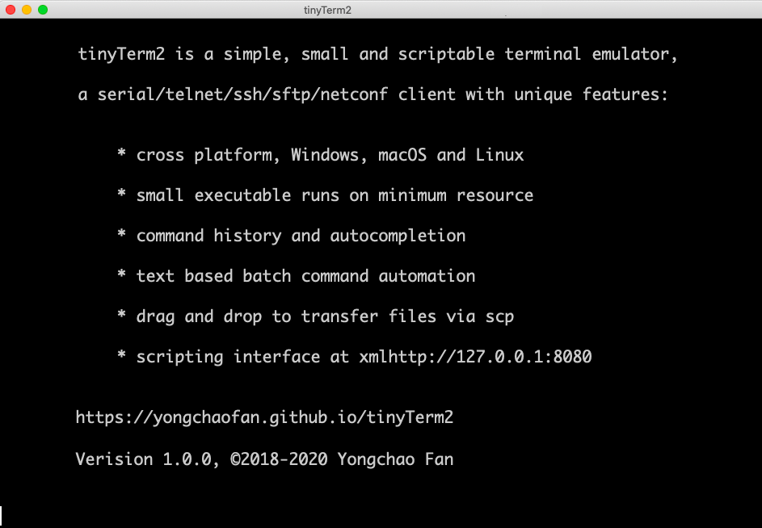

# [tinyTerm2](http://yongchaofan.github.io/tinyTerm2)

 

*Minimalist terminal emulator, designed by network engineer for network engineers, with unique features for effeciency and effectiveness when managing network devices like routers, switches, transponders and ROADMs through command line interface.*

## Project philosophy

tinyTerm2 is a rewrite of tinyTerm in C++ with FLTK and libssh2+mbedtls, resulting a cross platform terminal emulator, with multi-tab support, and continues to be small, simple and scriptable. Win32 executable is only 520KB, win64 executable is 640KB, macOS and linux executables are just above 1MB.

User interface design is minimal, program starts with no tabs, tabs are enabled automatically when second connection is made; scrollbar hidden until user trys to scroll back, only one dialog for makeing connections, 
    
### Librarys

    libssh2 1.9.0 for full support of WinCNG crypto functions
            ./configure --with-crypto=wincng --without-libz
            make install
            
    mbedTLS crypto library is used on macOS/UNIX/Linux/WindowsXP, download mbedtls-2.16.1, 
            "make no_test install"          //add WINDOWS_BUILD=1 on windows 
    then build libssh2
            ./configure --with-crypto=mbedtls --without-libz
            make install
            
### source files included:

    Fl_Browser_Input.h and Fl_Browser_Input.cxx extends Fl_Input with autocompletion

    Fl_Term.h and Fl_Term.cxx implements a vt100 terminal widget using FLTK

    ssh2.h and ssh2.cxx implements ssh, sftp and netconf hosts

    host.h and host.cxx implements telnet and serial hosts, plus ftp and tftp daemon for win32

    tiny2.cxx combines Fl_Term, host and ssh2 to create the simple terminal application
  

## Building
tinyTerm2 can be compiled on Windows using mingW or Visual Studio command line tools, on MacOS using command line development tool or on UNIX/Linux using gnu tools. Makefiles are provided for building with MSYS2+MingW64/32, also a cmd file for building with Visual Studio building tools.

    Makefile        building tinyTerm on macOS/Linux or on windows using mingw64
    make.cmd        command for Visual Studio 2017 build tool on windows using wincng crypto

The Makefiles provided assumes that FLTK and libssh2 are installed in /usr/local. MacOS and Linux Makefile are the same, mingW64 Makefile is a little different in that it uses Windows native crypto library(WinCNG) and includes a resource file to provide file version information and application icon. 
